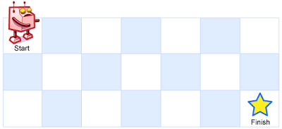

# [08.02. Robot in a Grid](https://leetcode.cn/problems/robot-in-a-grid-lcci)

[中文文档](/lcci/08.02.Robot%20in%20a%20Grid/README.md)

## Description

<p>Imagine a robot sitting on the upper left corner of grid with r rows and c columns. The robot can only move in two directions, right and down, but certain cells are &quot;off limits&quot; such that the robot cannot step on them. Design an algorithm to find a path for the robot from the top left to the bottom right.</p>

<p>&quot;off limits&quot; and empty grid are represented by&nbsp;<code>1</code> and&nbsp;<code>0</code>&nbsp;respectively.</p>
<p>Return a valid path, consisting of row number and column number of grids in the path.</p>
<p><strong>Example&nbsp;1:</strong></p>
<pre>

<strong>Input:

</strong>[

&nbsp; [<strong>0</strong>,<strong>0</strong>,<strong>0</strong>],

&nbsp; [0,1,<strong>0</strong>],

&nbsp; [0,0,<strong>0</strong>]

]

<strong>Output:</strong> [[0,0],[0,1],[0,2],[1,2],[2,2]]</pre>

<p><strong>Note: </strong></p>
<ul>
	<li><code>r,&nbsp;c &lt;= 100</code></li>
</ul>

## Solutions

### Solution 1: DFS (Depth-First Search)

We can use depth-first search to solve this problem. We start from the top left corner and move right or down until we reach the bottom right corner. If at some step, we find that the current position is an obstacle, or the current position is already in the path, then we return. Otherwise, we add the current position to the path and mark the current position as visited, then continue to move right or down.

If we can finally reach the bottom right corner, then we have found a feasible path, otherwise, it means there is no feasible path.

The time complexity is $O(m \times n)$, and the space complexity is $O(m \times n)$. Here, $m$ and $n$ are the number of rows and columns of the grid, respectively.

<!-- tabs:start -->

```python
class Solution:
    def pathWithObstacles(self, obstacleGrid: List[List[int]]) -> List[List[int]]:
        def dfs(i, j):
            if i >= m or j >= n or obstacleGrid[i][j] == 1:
                return False
            ans.append([i, j])
            obstacleGrid[i][j] = 1
            if (i == m - 1 and j == n - 1) or dfs(i + 1, j) or dfs(i, j + 1):
                return True
            ans.pop()
            return False

        m, n = len(obstacleGrid), len(obstacleGrid[0])
        ans = []
        return ans if dfs(0, 0) else []
```

```java
class Solution {
    private List<List<Integer>> ans = new ArrayList<>();
    private int[][] g;
    private int m;
    private int n;

    public List<List<Integer>> pathWithObstacles(int[][] obstacleGrid) {
        g = obstacleGrid;
        m = g.length;
        n = g[0].length;
        return dfs(0, 0) ? ans : Collections.emptyList();
    }

    private boolean dfs(int i, int j) {
        if (i >= m || j >= n || g[i][j] == 1) {
            return false;
        }
        ans.add(List.of(i, j));
        g[i][j] = 1;
        if ((i == m - 1 && j == n - 1) || dfs(i + 1, j) || dfs(i, j + 1)) {
            return true;
        }
        ans.remove(ans.size() - 1);
        return false;
    }
}
```

```cpp
class Solution {
public:
    vector<vector<int>> pathWithObstacles(vector<vector<int>>& obstacleGrid) {
        int m = obstacleGrid.size();
        int n = obstacleGrid[0].size();
        vector<vector<int>> ans;
        function<bool(int, int)> dfs = [&](int i, int j) -> bool {
            if (i >= m || j >= n || obstacleGrid[i][j] == 1) {
                return false;
            }
            ans.push_back({i, j});
            obstacleGrid[i][j] = 1;
            if ((i == m - 1 && j == n - 1) || dfs(i + 1, j) || dfs(i, j + 1)) {
                return true;
            }
            ans.pop_back();
            return false;
        };
        return dfs(0, 0) ? ans : vector<vector<int>>();
    }
};
```

```go
func pathWithObstacles(obstacleGrid [][]int) [][]int {
	m, n := len(obstacleGrid), len(obstacleGrid[0])
	ans := [][]int{}
	var dfs func(i, j int) bool
	dfs = func(i, j int) bool {
		if i >= m || j >= n || obstacleGrid[i][j] == 1 {
			return false
		}
		ans = append(ans, []int{i, j})
		obstacleGrid[i][j] = 1
		if (i == m-1 && j == n-1) || dfs(i+1, j) || dfs(i, j+1) {
			return true
		}
		ans = ans[:len(ans)-1]
		return false
	}
	if dfs(0, 0) {
		return ans
	}
	return [][]int{}
}
```

```ts
function pathWithObstacles(obstacleGrid: number[][]): number[][] {
    const m = obstacleGrid.length;
    const n = obstacleGrid[0].length;
    const res = [];
    const dfs = (i: number, j: number): boolean => {
        if (i === m || j === n || obstacleGrid[i][j] === 1) {
            return false;
        }
        res.push([i, j]);
        obstacleGrid[i][j] = 1;
        if ((i + 1 === m && j + 1 === n) || dfs(i + 1, j) || dfs(i, j + 1)) {
            return true;
        }
        res.pop();
        return false;
    };
    if (dfs(0, 0)) {
        return res;
    }
    return [];
}
```

```rust
impl Solution {
    fn dfs(grid: &mut Vec<Vec<i32>>, path: &mut Vec<Vec<i32>>, i: usize, j: usize) -> bool {
        if i == grid.len() || j == grid[0].len() || grid[i][j] == 1 {
            return false;
        }
        path.push(vec![i as i32, j as i32]);
        grid[i as usize][j as usize] = 1;
        if
            (i + 1 == grid.len() && j + 1 == grid[0].len()) ||
            Self::dfs(grid, path, i + 1, j) ||
            Self::dfs(grid, path, i, j + 1)
        {
            return true;
        }
        path.pop();
        false
    }

    pub fn path_with_obstacles(mut obstacle_grid: Vec<Vec<i32>>) -> Vec<Vec<i32>> {
        let mut res = vec![];
        if Self::dfs(&mut obstacle_grid, &mut res, 0, 0) {
            return res;
        }
        vec![]
    }
}
```

<!-- tabs:end -->

<!-- end -->
