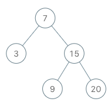

# [173. 二叉搜索树迭代器](https://leetcode-cn.com/problems/binary-search-tree-iterator)

[English Version](/solution/0100-0199/0173.Binary%20Search%20Tree%20Iterator/README_EN.md)

## 题目描述

<!-- 这里写题目描述 -->
<p>实现一个二叉搜索树迭代器。你将使用二叉搜索树的根节点初始化迭代器。</p>

<p>调用 <code>next()</code> 将返回二叉搜索树中的下一个最小的数。</p>

<p>&nbsp;</p>

<p><strong>示例：</strong></p>



<pre>BSTIterator iterator = new BSTIterator(root);
iterator.next();    // 返回 3
iterator.next();    // 返回 7
iterator.hasNext(); // 返回 true
iterator.next();    // 返回 9
iterator.hasNext(); // 返回 true
iterator.next();    // 返回 15
iterator.hasNext(); // 返回 true
iterator.next();    // 返回 20
iterator.hasNext(); // 返回 false</pre>

<p>&nbsp;</p>

<p><strong>提示：</strong></p>

<ul>
	<li><code>next()</code>&nbsp;和&nbsp;<code>hasNext()</code>&nbsp;操作的时间复杂度是&nbsp;O(1)，并使用&nbsp;O(<em>h</em>) 内存，其中&nbsp;<em>h&nbsp;</em>是树的高度。</li>
	<li>你可以假设&nbsp;<code>next()</code>&nbsp;调用总是有效的，也就是说，当调用 <code>next()</code>&nbsp;时，BST 中至少存在一个下一个最小的数。</li>
</ul>

## 解法

<!-- 这里可写通用的实现逻辑 -->

初始化数据时，递归中序遍历，将二叉搜索树每个结点的值保存在列表 `vals` 中。用 `cur/next` 指针记录外部即将遍历的位置，初始化为 0。

调用 `next()` 时，返回 `vals[cur]`，同时 `cur` 指针自增。调用 `hasNext()` 时，判断 `cur` 指针是否已经达到 `vals` 个数，若是，说明已经遍历结束，返回 false，否则返回 true。

<!-- tabs:start -->

### **Python3**

<!-- 这里可写当前语言的特殊实现逻辑 -->

```python
# Definition for a binary tree node.
# class TreeNode:
#     def __init__(self, val=0, left=None, right=None):
#         self.val = val
#         self.left = left
#         self.right = right
class BSTIterator:

    def __init__(self, root: TreeNode):
        def inorder(root):
            if root is None:
                return
            inorder(root.left)
            self.vals.append(root.val)
            inorder(root.right)

        self.cur = 0
        self.vals = []
        inorder(root)

    def next(self) -> int:
        res = self.vals[self.cur]
        self.cur += 1
        return res

    def hasNext(self) -> bool:
        return self.cur < len(self.vals)


# Your BSTIterator object will be instantiated and called as such:
# obj = BSTIterator(root)
# param_1 = obj.next()
# param_2 = obj.hasNext()
```

### **Java**

<!-- 这里可写当前语言的特殊实现逻辑 -->

```java
/**
 * Definition for a binary tree node.
 * public class TreeNode {
 *     int val;
 *     TreeNode left;
 *     TreeNode right;
 *     TreeNode() {}
 *     TreeNode(int val) { this.val = val; }
 *     TreeNode(int val, TreeNode left, TreeNode right) {
 *         this.val = val;
 *         this.left = left;
 *         this.right = right;
 *     }
 * }
 */
class BSTIterator {

    private List<Integer> vals;
    private int next;

    public BSTIterator(TreeNode root) {
        next = 0;
        vals = new ArrayList<>();
        inorder(root);
    }

    public int next() {
        return vals.get(next++);
    }

    public boolean hasNext() {
        return next < vals.size();
    }

    private void inorder(TreeNode root) {
        if (root == null) {
            return;
        }
        inorder(root.left);
        vals.add(root.val);
        inorder(root.right);
    }
}

/**
 * Your BSTIterator object will be instantiated and called as such:
 * BSTIterator obj = new BSTIterator(root);
 * int param_1 = obj.next();
 * boolean param_2 = obj.hasNext();
 */
```

### **...**

```

```

<!-- tabs:end -->
