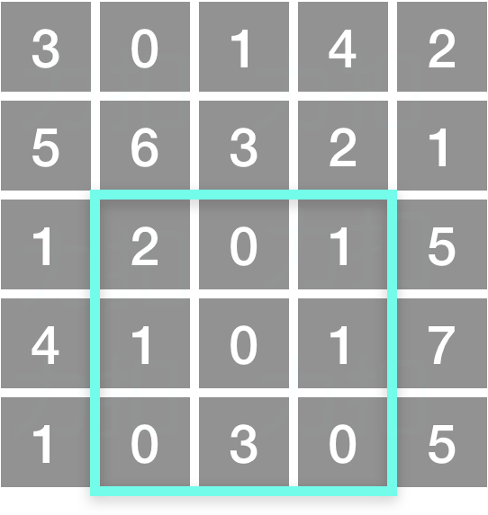

# [304. 二维区域和检索 - 矩阵不可变](https://leetcode-cn.com/problems/range-sum-query-2d-immutable)

[English Version](/solution/0300-0399/0304.Range%20Sum%20Query%202D%20-%20Immutable/README_EN.md)

## 题目描述

<!-- 这里写题目描述 -->
<p>给定一个二维矩阵，计算其子矩形范围内元素的总和，该子矩阵的左上角为 (<em>row</em>1,&nbsp;<em>col</em>1) ，右下角为 (<em>row</em>2,&nbsp;<em>col</em>2)。</p>



<small>上图子矩阵左上角&nbsp;(row1, col1) = <strong>(2, 1)</strong>&nbsp;，右下角(row2, col2) = <strong>(4, 3)，</strong>该子矩形内元素的总和为 8。</small></p>

<p><strong>示例:</strong></p>

<pre>给定 matrix = [
  [3, 0, 1, 4, 2],
  [5, 6, 3, 2, 1],
  [1, 2, 0, 1, 5],
  [4, 1, 0, 1, 7],
  [1, 0, 3, 0, 5]
]

sumRegion(2, 1, 4, 3) -&gt; 8
sumRegion(1, 1, 2, 2) -&gt; 11
sumRegion(1, 2, 2, 4) -&gt; 12
</pre>

<p><strong>说明:</strong></p>

<ol>
	<li>你可以假设矩阵不可变。</li>
	<li>会多次调用&nbsp;<em>sumRegion&nbsp;</em>方法<em>。</em></li>
	<li>你可以假设&nbsp;<em>row</em>1 &le; <em>row</em>2 且&nbsp;<em>col</em>1 &le; <em>col</em>2。</li>
</ol>

## 解法

<!-- 这里可写通用的实现逻辑 -->

<!-- tabs:start -->

### **Python3**

<!-- 这里可写当前语言的特殊实现逻辑 -->

```python
class NumMatrix:

    def __init__(self, matrix: List[List[int]]):
        m = len(matrix)
        if m > 0:
            n = len(matrix[0])
            self.sums = [[0] * (n + 1) for _ in range(m + 1)]
            for i in range(m):
                for j in range(n):
                    self.sums[i + 1][j + 1] = self.sums[i][j + 1] + \
                        self.sums[i + 1][j] - self.sums[i][j] + matrix[i][j]

    def sumRegion(self, row1: int, col1: int, row2: int, col2: int) -> int:
        return self.sums[row2 + 1][col2 + 1] - self.sums[row2 + 1][col1] - self.sums[row1][col2 + 1] + self.sums[row1][col1]


# Your NumMatrix object will be instantiated and called as such:
# obj = NumMatrix(matrix)
# param_1 = obj.sumRegion(row1,col1,row2,col2)
```

### **Java**

<!-- 这里可写当前语言的特殊实现逻辑 -->

```java
class NumMatrix {
    private int[][] sums;

    public NumMatrix(int[][] matrix) {
        int m = matrix.length;
        if (m > 0) {
            int n = matrix[0].length;
            sums = new int[m + 1][n + 1];
            for (int i = 0; i < m; ++i) {
                for (int j = 0; j < n; ++j) {
                    sums[i + 1][j + 1] = sums[i][j + 1] + sums[i + 1][j] - sums[i][j] + matrix[i][j];
                }
            }
        }
    }

    public int sumRegion(int row1, int col1, int row2, int col2) {
        return sums[row2 + 1][col2 + 1] - sums[row2 + 1][col1] - sums[row1][col2 + 1] + sums[row1][col1];
    }
}

/**
 * Your NumMatrix object will be instantiated and called as such:
 * NumMatrix obj = new NumMatrix(matrix);
 * int param_1 = obj.sumRegion(row1,col1,row2,col2);
 */
```

### **...**

```

```

<!-- tabs:end -->
