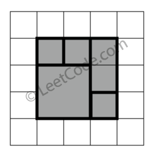
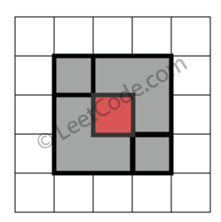

# [391. 完美矩形](https://leetcode-cn.com/problems/perfect-rectangle)

[English Version](/solution/0300-0399/0391.Perfect%20Rectangle/README_EN.md)

## 题目描述
<!-- 这里写题目描述 -->
<p>我们有 N 个与坐标轴对齐的矩形, 其中 N &gt; 0, 判断它们是否能精确地覆盖一个矩形区域。</p>

<p>每个矩形用左下角的点和右上角的点的坐标来表示。例如，&nbsp;一个单位正方形可以表示为 [1,1,2,2]。&nbsp;( 左下角的点的坐标为 (1, 1) 以及右上角的点的坐标为 (2, 2) )。</p>



<p><strong>示例 1:</strong></p>

<pre>rectangles = [
  [1,1,3,3],
  [3,1,4,2],
  [3,2,4,4],
  [1,3,2,4],
  [2,3,3,4]
]

返回 true。5个矩形一起可以精确地覆盖一个矩形区域。
</pre>

<p>&nbsp;</p>


<p><strong>示例&nbsp;2:</strong></p>

<pre>rectangles = [
  [1,1,2,3],
  [1,3,2,4],
  [3,1,4,2],
  [3,2,4,4]
]

返回 false。两个矩形之间有间隔，无法覆盖成一个矩形。
</pre>

<p>&nbsp;</p>


<p><strong>示例 3:</strong></p>

<pre>rectangles = [
  [1,1,3,3],
  [3,1,4,2],
  [1,3,2,4],
  [3,2,4,4]
]

返回 false。图形顶端留有间隔，无法覆盖成一个矩形。
</pre>

<p>&nbsp;</p>



<p><strong>示例 4:</strong></p>

<pre>rectangles = [
  [1,1,3,3],
  [3,1,4,2],
  [1,3,2,4],
  [2,2,4,4]
]

返回 false。因为中间有相交区域，虽然形成了矩形，但不是精确覆盖。
</pre>


## 解法
<!-- 这里可写通用的实现逻辑 -->


<!-- tabs:start -->

### **Python3**
<!-- 这里可写当前语言的特殊实现逻辑 -->

```python

```

### **Java**
<!-- 这里可写当前语言的特殊实现逻辑 -->

```java

```

### **...**
```

```

<!-- tabs:end -->