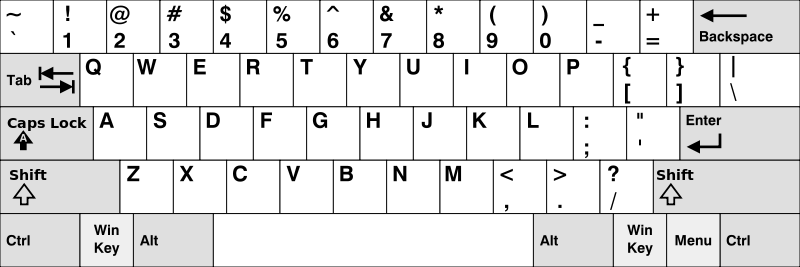

# [500. 键盘行](https://leetcode-cn.com/problems/keyboard-row)

[English Version](/solution/0500-0599/0500.Keyboard%20Row/README_EN.md)

## 题目描述

<!-- 这里写题目描述 -->
<p>给定一个单词列表，只返回可以使用在键盘同一行的字母打印出来的单词。键盘如下图所示。</p>

<p>&nbsp;</p>



<p>&nbsp;</p>

<p><strong>示例：</strong></p>

<pre><strong>输入:</strong> [&quot;Hello&quot;, &quot;Alaska&quot;, &quot;Dad&quot;, &quot;Peace&quot;]

<strong>输出:</strong> [&quot;Alaska&quot;, &quot;Dad&quot;]

</pre>

<p>&nbsp;</p>

<p><strong>注意：</strong></p>

<ol>
	<li>你可以重复使用键盘上同一字符。</li>
	<li>你可以假设输入的字符串将只包含字母。</li>
</ol>

## 解法

<!-- 这里可写通用的实现逻辑 -->

<!-- tabs:start -->

### **Python3**

<!-- 这里可写当前语言的特殊实现逻辑 -->

用三个集合存储键盘每一行字母。

遍历单词列表 `words`，判断每个单词 `word` 转 set 后是否被以上三个集合其中之一包含，若是，将单词添加到结果数组。

```python
class Solution:
    def findWords(self, words: List[str]) -> List[str]:
        s1 = set('qwertyuiop')
        s2 = set('asdfghjkl')
        s3 = set('zxcvbnm')
        res = []
        for word in words:
            t = set(word.lower())
            if t <= s1 or t <= s2 or t <= s3:
                # 利用 python set 比较
                res.append(word)
        return res
```

### **Java**

<!-- 这里可写当前语言的特殊实现逻辑 -->

用三个字符串存储键盘每一行字母。

遍历单词列表 `words`，对于每个单词 `word`：

1. 分别设置三个计数器，存储当前单词在对应键盘字符串的字母个数；
2. 遍历 `word` 中的每个字母，如果在对应的键盘字符串中，则对应的计数器加 1；
3. 单词遍历结束后，判断是否存在一个计数器值与 `word` 长度相同。如果有，说明该单词所有字母都在同一个键盘字符串中，将单词添加到结果数组。

```java
class Solution {
    public String[] findWords(String[] words) {
        String s1 = "qwertyuiopQWERTYUIOP";
        String s2 = "asdfghjklASDFGHJKL";
        String s3 = "zxcvbnmZXCVBNM";
        List<String> res = new ArrayList<>();
        for (String word : words) {
            int n1 = 0, n2 = 0, n3 = 0;
            int n = word.length();
            for (int i = 0; i < n; ++i) {
                if (s1.contains(String.valueOf(word.charAt(i)))) {
                    ++n1;
                } else if (s2.contains(String.valueOf(word.charAt(i)))) {
                    ++n2;
                } else {
                    ++n3;
                }
            }
            if (n1 == n || n2 == n || n3 == n) {
                res.add(word);
            }
        }
        return res.toArray(new String[0]);
    }
}
```

### **...**

```

```

<!-- tabs:end -->
