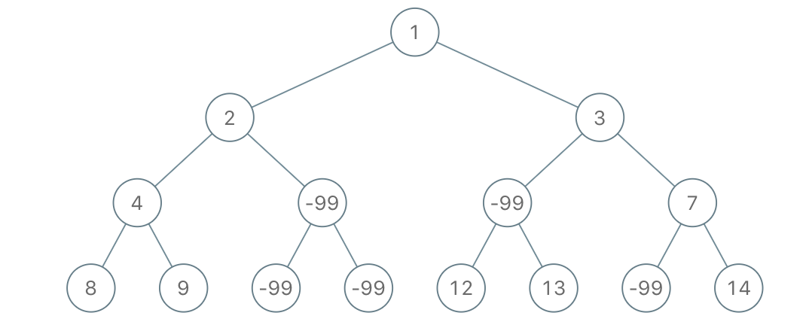
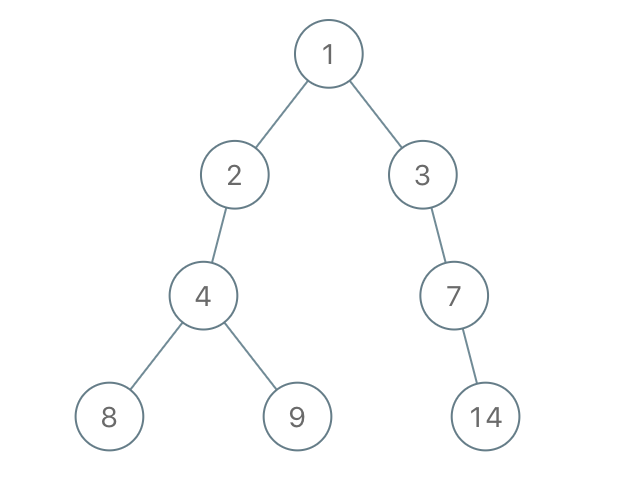
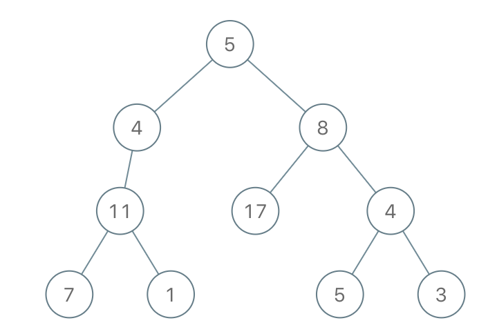
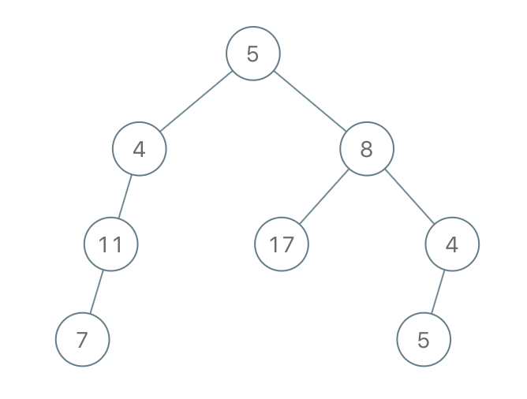
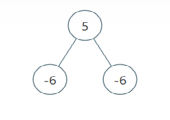

# [1080. 根到叶路径上的不足节点](https://leetcode-cn.com/problems/insufficient-nodes-in-root-to-leaf-paths)

[English Version](/solution/1000-1099/1080.Insufficient%20Nodes%20in%20Root%20to%20Leaf%20Paths/README_EN.md)

## 题目描述
<!-- 这里写题目描述 -->
<p>给定一棵二叉树的根 <code>root</code>，请你考虑它所有&nbsp;<strong>从根到叶的路径</strong>：从根到任何叶的路径。（所谓一个叶子节点，就是一个没有子节点的节点）</p>

<p>假如通过节点 <code>node</code> 的每种可能的 &ldquo;根-叶&rdquo; 路径上值的总和全都小于给定的 <code>limit</code>，则该节点被称之为「不足节点」，需要被删除。</p>

<p>请你删除所有不足节点，并返回生成的二叉树的根。</p>

<p>&nbsp;</p>

<p><strong>示例 1：</strong></p>



<pre><strong>
输入：</strong>root = [1,2,3,4,-99,-99,7,8,9,-99,-99,12,13,-99,14], limit = 1</pre>



<pre>
<strong>
输出：</strong>[1,2,3,4,null,null,7,8,9,null,14]
</pre>

<p><strong>示例 2：</strong></p>



<pre><strong>
输入：</strong>root = [5,4,8,11,null,17,4,7,1,null,null,5,3], limit = 22
</pre>



<pre><strong>
输出：</strong>[5,4,8,11,null,17,4,7,null,null,null,5]</pre>

<p><strong>示例 3：</strong></p>



<pre><strong>
输入：</strong>root = [5,-6,-6], limit = 0<strong>
输出：</strong>[]</pre>

<p>&nbsp;</p>

<p><strong>提示：</strong></p>

<ol>
	<li>给定的树有&nbsp;<code>1</code>&nbsp;到&nbsp;<code>5000</code>&nbsp;个节点</li>
	<li><code>-10^5&nbsp;&lt;= node.val &lt;= 10^5</code></li>
	<li><code>-10^9 &lt;= limit&nbsp;&lt;= 10^9</code></li>
</ol>

<p>&nbsp;</p>


## 解法
<!-- 这里可写通用的实现逻辑 -->


<!-- tabs:start -->

### **Python3**
<!-- 这里可写当前语言的特殊实现逻辑 -->

```python

```

### **Java**
<!-- 这里可写当前语言的特殊实现逻辑 -->

```java

```

### **...**
```

```

<!-- tabs:end -->