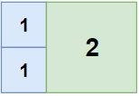
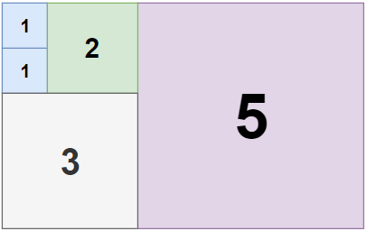
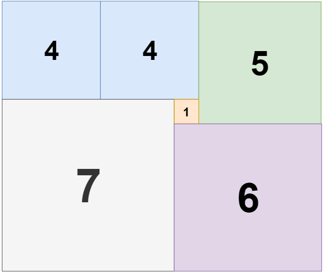

# [1240. Tiling a Rectangle with the Fewest Squares](https://leetcode.com/problems/tiling-a-rectangle-with-the-fewest-squares)

[中文文档](/solution/1200-1299/1240.Tiling%20a%20Rectangle%20with%20the%20Fewest%20Squares/README.md)

## Description
<p>Given a rectangle of size&nbsp;<code>n</code>&nbsp;x <code><font face="monospace">m</font></code>, find the minimum number of integer-sided squares that tile the rectangle.</p>

<p>&nbsp;</p>
<p><strong>Example 1:</strong></p>




<pre>
<strong>Input:</strong> n = 2, m = 3
<strong>Output:</strong> 3
<strong>Explanation:</strong> <code>3</code> squares are necessary to cover the rectangle.
<code>2</code> (squares of <code>1x1</code>)
<code>1</code> (square of <code>2x2</code>)</pre>

<p><strong>Example 2:</strong></p>




<pre>
<strong>Input:</strong> n = 5, m = 8
<strong>Output:</strong> 5
</pre>

<p><strong>Example 3:</strong></p>




<pre>
<strong>Input:</strong> n = 11, m = 13
<strong>Output:</strong> 6
</pre>

<p>&nbsp;</p>
<p><strong>Constraints:</strong></p>

<ul>
	<li><code>1 &lt;= n &lt;= 13</code></li>
	<li><code>1 &lt;= m&nbsp;&lt;=&nbsp;13</code></li>
</ul>


## Solutions


<!-- tabs:start -->

### **Python3**

```python

```

### **Java**

```java

```

### **...**
```

```

<!-- tabs:end -->