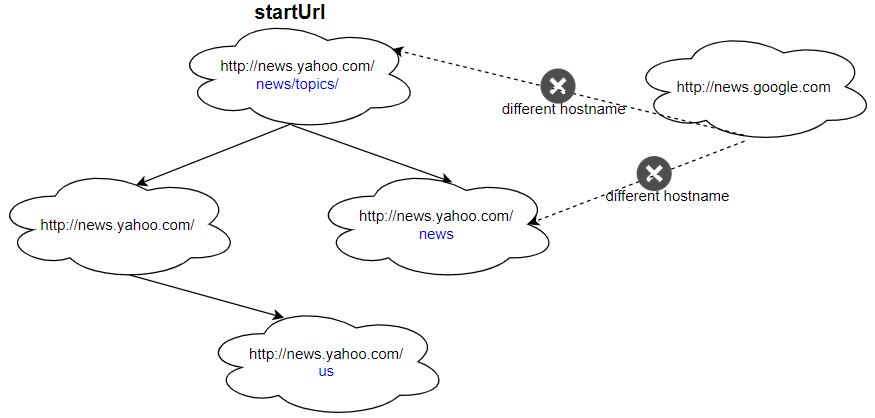
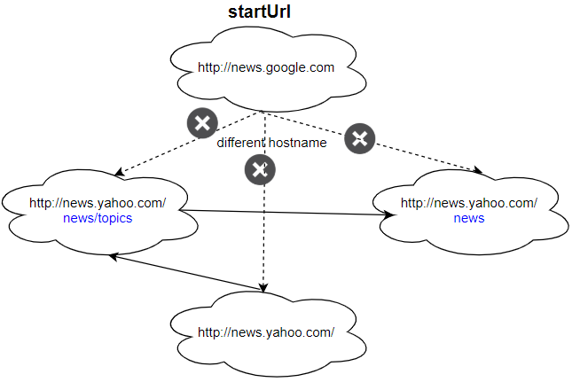

# [1242. Web Crawler Multithreaded](https://leetcode.com/problems/web-crawler-multithreaded)

[中文文档](/solution/1200-1299/1242.Web%20Crawler%20Multithreaded/README.md)

## Description

<p>Given a url <code>startUrl</code> and an interface <code>HtmlParser</code>, implement <strong>a Multi-threaded web&nbsp;crawler</strong> to crawl all links that are under the&nbsp;<strong>same hostname</strong> as&nbsp;<code>startUrl</code>.&nbsp;</p>

<p>Return&nbsp;all urls obtained by your web crawler in <strong>any</strong> order.</p>

<p>Your crawler should:</p>

<ul>
	<li>Start from the page: <code>startUrl</code></li>
	<li>Call <code>HtmlParser.getUrls(url)</code> to get all urls from a webpage of given url.</li>
	<li>Do not crawl the same link twice.</li>
	<li>Explore only the links that are under the <strong>same hostname</strong> as <code>startUrl</code>.</li>
</ul>


<p>As shown in the example url above, the hostname is <code>example.org</code>. For simplicity sake, you may assume all&nbsp;urls use <strong>http protocol</strong> without any&nbsp;<strong>port</strong> specified. For example, the urls&nbsp;<code>http://leetcode.com/problems</code> and&nbsp;<code>http://leetcode.com/contest</code> are under the same hostname, while urls <code>http://example.org/test</code> and <code>http://example.com/abc</code> are not under the same hostname.</p>

<p>The <code>HtmlParser</code> interface is defined as such:&nbsp;</p>

<pre>
interface HtmlParser {
  // Return a list of all urls from a webpage of given <em>url</em>.
  // This is a blocking call, that means it will do HTTP request and return when this request is finished.
  public List&lt;String&gt; getUrls(String url);
}</pre>

<p>Note that&nbsp;<code>getUrls(String url)</code>&nbsp;simulates performing a&nbsp;HTTP request. You can treat it as a blocking function call which waits for a&nbsp;HTTP request to finish. It is guaranteed that&nbsp;<code>getUrls(String url)</code> will return the urls within <strong>15ms.&nbsp;</strong> Single-threaded solutions will exceed the time limit so, can your multi-threaded web crawler do better?</p>

<p>Below&nbsp;are two examples explaining the functionality of the problem, for custom testing purposes you&#39;ll have three&nbsp;variables&nbsp;<code data-stringify-type="code">urls</code>,&nbsp;<code data-stringify-type="code">edges</code>&nbsp;and&nbsp;<code data-stringify-type="code">startUrl</code>. Notice that you will only have access to&nbsp;<code data-stringify-type="code">startUrl</code>&nbsp;in your code, while&nbsp;<code data-stringify-type="code">urls</code>&nbsp;and&nbsp;<code data-stringify-type="code">edges</code>&nbsp;are not directly accessible to you in code.</p>

<p>&nbsp;</p>

<p><strong>Follow up:</strong></p>

<ol>
	<li>Assume we have 10,000 nodes and 1 billion URLs to crawl.&nbsp;We will deploy the same software onto each node.&nbsp;The software can know about all the nodes. We have to minimize communication between machines and make sure each node does equal amount of work. How would your web crawler design change?</li>
	<li>What if one node fails or does not work?</li>
	<li>How do you know when the crawler is done?</li>
</ol>

<p>&nbsp;</p>
<p><strong>Example 1:</strong></p>



<pre>
<strong>Input:
</strong>urls = [
&nbsp; &quot;http://news.yahoo.com&quot;,
&nbsp; &quot;http://news.yahoo.com/news&quot;,
&nbsp; &quot;http://news.yahoo.com/news/topics/&quot;,
&nbsp; &quot;http://news.google.com&quot;,
&nbsp; &quot;http://news.yahoo.com/us&quot;
]
edges = [[2,0],[2,1],[3,2],[3,1],[0,4]]
startUrl = &quot;http://news.yahoo.com/news/topics/&quot;
<strong>Output:</strong> [
&nbsp; &quot;http://news.yahoo.com&quot;,
&nbsp; &quot;http://news.yahoo.com/news&quot;,
&nbsp; &quot;http://news.yahoo.com/news/topics/&quot;,
&nbsp; &quot;http://news.yahoo.com/us&quot;
]
</pre>

<p><strong>Example 2:</strong></p>



<pre>
<strong>Input:</strong> 
urls = [
&nbsp; &quot;http://news.yahoo.com&quot;,
&nbsp; &quot;http://news.yahoo.com/news&quot;,
&nbsp; &quot;http://news.yahoo.com/news/topics/&quot;,
&nbsp; &quot;http://news.google.com&quot;
]
edges = [[0,2],[2,1],[3,2],[3,1],[3,0]]
startUrl = &quot;http://news.google.com&quot;
<strong>Output:</strong> [&quot;http://news.google.com&quot;]
<strong>Explanation: </strong>The startUrl links to all other pages that do not share the same hostname.</pre>

<p>&nbsp;</p>
<p><strong>Constraints:</strong></p>

<ul>
	<li><code>1 &lt;= urls.length &lt;= 1000</code></li>
	<li><code>1 &lt;= urls[i].length &lt;= 300</code></li>
	<li><code>startUrl</code>&nbsp;is one of the <code>urls</code>.</li>
	<li>Hostname label must be from 1 to 63 characters long, including the dots, may contain only the ASCII letters from &#39;a&#39; to&nbsp;&#39;z&#39;, digits from &#39;0&#39; to &#39;9&#39; and the&nbsp;hyphen-minus&nbsp;character (&#39;-&#39;).</li>
	<li>The hostname may not start or end with&nbsp;the hyphen-minus character (&#39;-&#39;).&nbsp;</li>
	<li>See:&nbsp;&nbsp;<a href="https://en.wikipedia.org/wiki/Hostname#Restrictions_on_valid_hostnames">https://en.wikipedia.org/wiki/Hostname#Restrictions_on_valid_hostnames</a></li>
	<li>You may assume there&#39;re&nbsp;no duplicates in url library.</li>
</ul>


## Solutions

<!-- tabs:start -->

### **Python3**

```python

```

### **Java**

```java

```

### **...**

```

```

<!-- tabs:end -->
