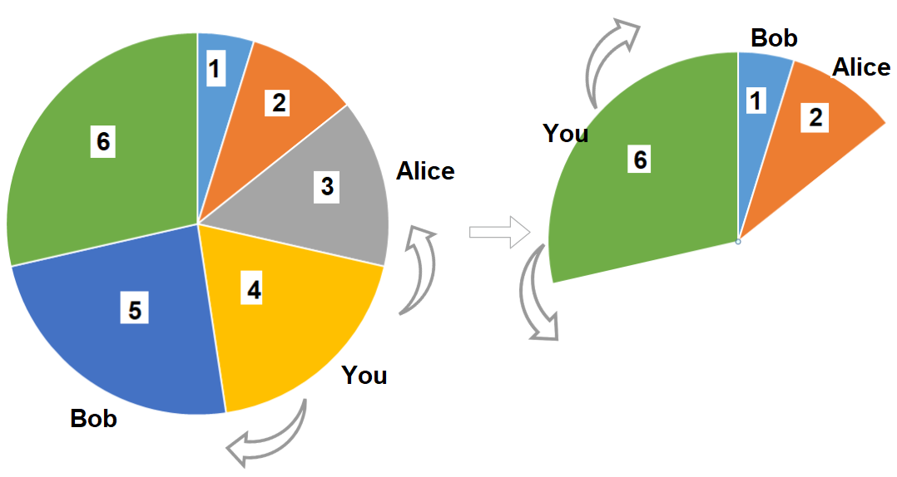
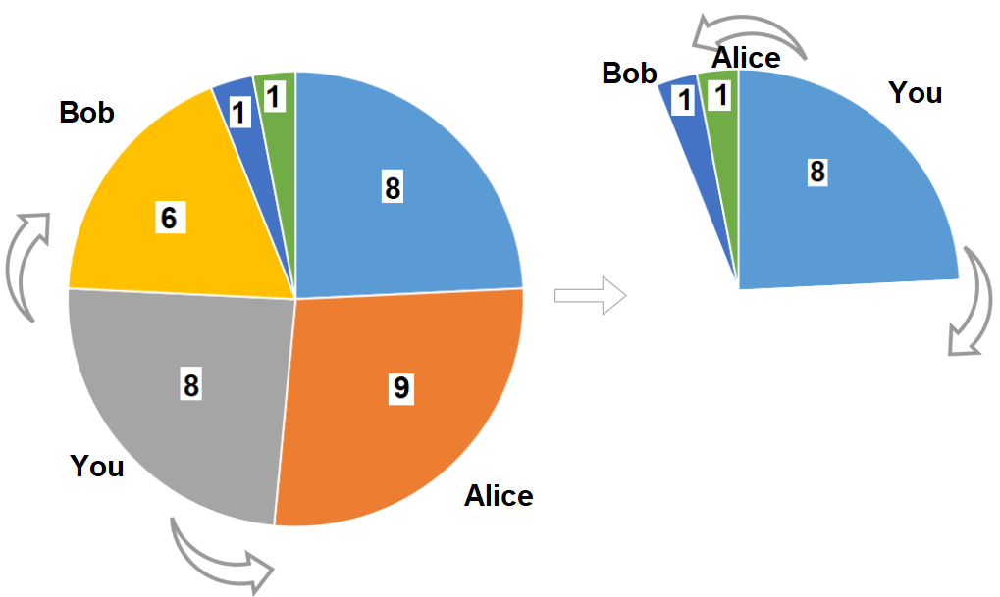

# [1388. 3n 块披萨](https://leetcode-cn.com/problems/pizza-with-3n-slices)

[English Version](/solution/1300-1399/1388.Pizza%20With%203n%20Slices/README_EN.md)

## 题目描述

<!-- 这里写题目描述 -->
<p>给你一个披萨，它由 3n 块不同大小的部分组成，现在你和你的朋友们需要按照如下规则来分披萨：</p>

<ul>
	<li>你挑选 <strong>任意</strong>&nbsp;一块披萨。</li>
	<li>Alice 将会挑选你所选择的披萨逆时针方向的下一块披萨。</li>
	<li>Bob 将会挑选你所选择的披萨顺时针方向的下一块披萨。</li>
	<li>重复上述过程直到没有披萨剩下。</li>
</ul>

<p>每一块披萨的大小按顺时针方向由循环数组 <code>slices</code>&nbsp;表示。</p>

<p>请你返回你可以获得的披萨大小总和的最大值。</p>

<p>&nbsp;</p>

<p><strong>示例 1：</strong></p>



<pre><strong>输入：</strong>slices = [1,2,3,4,5,6]
<strong>输出：</strong>10
<strong>解释：</strong>选择大小为 4 的披萨，Alice 和 Bob 分别挑选大小为 3 和 5 的披萨。然后你选择大小为 6 的披萨，Alice 和 Bob 分别挑选大小为 2 和 1 的披萨。你获得的披萨总大小为 4 + 6 = 10 。
</pre>

<p><strong>示例 2：</strong></p>



<pre><strong>输入：</strong>slices = [8,9,8,6,1,1]
<strong>输出：</strong>16
<strong>解释：</strong>两轮都选大小为 8 的披萨。如果你选择大小为 9 的披萨，你的朋友们就会选择大小为 8 的披萨，这种情况下你的总和不是最大的。
</pre>

<p><strong>示例 3：</strong></p>

<pre><strong>输入：</strong>slices = [4,1,2,5,8,3,1,9,7]
<strong>输出：</strong>21
</pre>

<p><strong>示例 4：</strong></p>

<pre><strong>输入：</strong>slices = [3,1,2]
<strong>输出：</strong>3
</pre>

<p>&nbsp;</p>

<p><strong>提示：</strong></p>

<ul>
	<li><code>1 &lt;= slices.length &lt;= 500</code></li>
	<li><code>slices.length % 3 == 0</code></li>
	<li><code>1 &lt;= slices[i] &lt;= 1000</code></li>
</ul>


## 解法

<!-- 这里可写通用的实现逻辑 -->


<!-- tabs:start -->

### **Python3**

<!-- 这里可写当前语言的特殊实现逻辑 -->

```python

```

### **Java**

<!-- 这里可写当前语言的特殊实现逻辑 -->

```java

```

### **...**
```

```

<!-- tabs:end -->