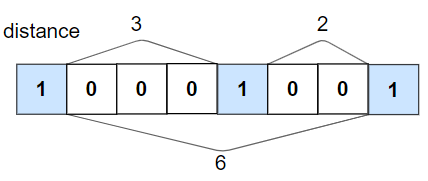
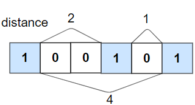

# [1437. Check If All 1's Are at Least Length K Places Away](https://leetcode.com/problems/check-if-all-1s-are-at-least-length-k-places-away)

[中文文档](/solution/1400-1499/1437.Check%20If%20All%201%27s%20Are%20at%20Least%20Length%20K%20Places%20Away/README.md)

## Description

<p>Given an array <code>nums</code> of 0s and 1s and an integer <code>k</code>, return <code>True</code> if all 1&#39;s are at least <code>k</code> places away from each other, otherwise return <code>False</code>.</p>

<p>&nbsp;</p>
<p><strong>Example 1:</strong></p>



<pre>
<strong>Input:</strong> nums = [1,0,0,0,1,0,0,1], k = 2
<strong>Output:</strong> true
<strong>Explanation:</strong> Each of the 1s are at least 2 places away from each other.
</pre>

<p><strong>Example 2:</strong></p>



<pre>
<strong>Input:</strong> nums = [1,0,0,1,0,1], k = 2
<strong>Output:</strong> false
<strong>Explanation: </strong>The second 1 and third 1 are only one apart from each other.</pre>

<p><strong>Example 3:</strong></p>

<pre>
<strong>Input:</strong> nums = [1,1,1,1,1], k = 0
<strong>Output:</strong> true
</pre>

<p><strong>Example 4:</strong></p>

<pre>
<strong>Input:</strong> nums = [0,1,0,1], k = 1
<strong>Output:</strong> true
</pre>

<p>&nbsp;</p>
<p><strong>Constraints:</strong></p>

<ul>
	<li><code>1 &lt;= nums.length &lt;= 10^5</code></li>
	<li><code>0 &lt;= k &lt;= nums.length</code></li>
	<li><code>nums[i]</code>&nbsp;is&nbsp;<code>0</code>&nbsp;or&nbsp;<code>1</code></li>
</ul>


## Solutions


<!-- tabs:start -->

### **Python3**


```python

```

### **Java**


```java

```

### **...**
```

```

<!-- tabs:end -->