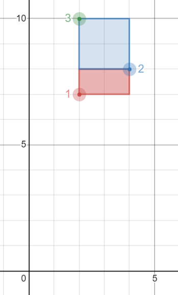

# [1459. Rectangles Area](https://leetcode.com/problems/rectangles-area)

[中文文档](/solution/1400-1499/1459.Rectangles%20Area/README.md)

## Description

<p>Table: <code>Points</code></p>

<pre>
+---------------+---------+
| Column Name   | Type    |
+---------------+---------+
| id            | int     |
| x_value       | int     |
| y_value       | int     |
+---------------+---------+
id is the primary key for this table.
Each point is represented as a 2D coordinate (x_value, y_value).</pre>

<p>&nbsp;</p>

<p>Write an SQL query to report all possible <strong>axis-aligned</strong> rectangles with <strong>non-zero area</strong> that can be formed by any two points in the <code>Points</code> table.</p>

<p>Each row in the result should contain three columns <code>(p1, p2, area)</code> where:</p>

<ul>
	<li><code>p1</code> and <code>p2</code> are the <code>id</code>&#39;s of the two points that determine the opposite corners of a rectangle.</li>
	<li><code>area</code> is the area of the rectangle and must be <strong>non-zero</strong>.</li>
</ul>

<p>Report the query in descending order by <code>area</code> first, then in ascending order by <code>p1</code>&#39;s <code>id</code> if there is a tie, then in ascending order by <code>p2</code>&#39;s <code>id</code> if there is another tie.</p>

<p>The query result format is in the following table:</p>

<p>&nbsp;</p>

<pre>
Points table:
+----------+-------------+-------------+
| id       | x_value     | y_value     |
+----------+-------------+-------------+
| 1        | 2           | 7           |
| 2        | 4           | 8           |
| 3        | 2           | 10          |
+----------+-------------+-------------+

Result table:
+----------+-------------+-------------+
| p1       | p2          | area        |
+----------+-------------+-------------+
| 2        | 3           | 4           |
| 1        | 2           | 2           |
+----------+-------------+-------------+

The rectangle formed by p1 = 2 and p2 = 3 has an area equal to |4-2| * |8-10| = 4.
The rectangle formed by p1 = 1 and p2 = 2 has an area equal to |2-4| * |7-8| = 2.
Note that the rectangle formed by p1 = 1 and p2 = 3 is invalid because the area is 0.
</pre>



## Solutions

<!-- tabs:start -->

### **SQL**

```sql

```

<!-- tabs:end -->