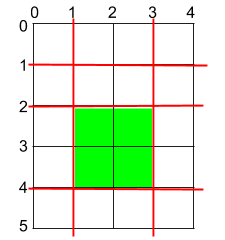
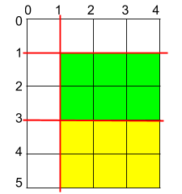

# [1465. 切割后面积最大的蛋糕](https://leetcode-cn.com/problems/maximum-area-of-a-piece-of-cake-after-horizontal-and-vertical-cuts)

[English Version](/solution/1400-1499/1465.Maximum%20Area%20of%20a%20Piece%20of%20Cake%20After%20Horizontal%20and%20Vertical%20Cuts/README_EN.md)

## 题目描述

<!-- 这里写题目描述 -->
<p>矩形蛋糕的高度为 <code>h</code> 且宽度为 <code>w</code>，给你两个整数数组 <code>horizontalCuts</code> 和 <code>verticalCuts</code>，其中 <code>horizontalCuts[i]</code> 是从矩形蛋糕顶部到第&nbsp; <code>i</code> 个水平切口的距离，类似地， <code>verticalCuts[j]</code> 是从矩形蛋糕的左侧到第 <code>j</code> 个竖直切口的距离。</p>

<p>请你按数组 <em><code>horizontalCuts</code> </em>和<em> <code>verticalCuts</code> </em>中提供的水平和竖直位置切割后，请你找出 <strong>面积最大</strong> 的那份蛋糕，并返回其 <strong>面积</strong> 。由于答案可能是一个很大的数字，因此需要将结果对 <code>10^9 + 7</code> 取余后返回。</p>

<p>&nbsp;</p>

<p><strong>示例 1：</strong></p>



<pre><strong>输入：</strong>h = 5, w = 4, horizontalCuts = [1,2,4], verticalCuts = [1,3]
<strong>输出：</strong>4 
<strong>解释：</strong>上图所示的矩阵蛋糕中，红色线表示水平和竖直方向上的切口。切割蛋糕后，绿色的那份蛋糕面积最大。
</pre>

<p><strong>示例 2：</strong></p>



<pre><strong>输入：</strong>h = 5, w = 4, horizontalCuts = [3,1], verticalCuts = [1]
<strong>输出：</strong>6
<strong>解释：</strong>上图所示的矩阵蛋糕中，红色线表示水平和竖直方向上的切口。切割蛋糕后，绿色和黄色的两份蛋糕面积最大。</pre>

<p><strong>示例 3：</strong></p>

<pre><strong>输入：</strong>h = 5, w = 4, horizontalCuts = [3], verticalCuts = [3]
<strong>输出：</strong>9
</pre>

<p>&nbsp;</p>

<p><strong>提示：</strong></p>

<ul>
	<li><code>2 &lt;= h,&nbsp;w &lt;= 10^9</code></li>
	<li><code>1 &lt;=&nbsp;horizontalCuts.length &lt;&nbsp;min(h, 10^5)</code></li>
	<li><code>1 &lt;=&nbsp;verticalCuts.length &lt; min(w, 10^5)</code></li>
	<li><code>1 &lt;=&nbsp;horizontalCuts[i] &lt; h</code></li>
	<li><code>1 &lt;=&nbsp;verticalCuts[i] &lt; w</code></li>
	<li>题目数据保证 <code>horizontalCuts</code> 中的所有元素各不相同</li>
	<li>题目数据保证 <code>verticalCuts</code>&nbsp;中的所有元素各不相同</li>
</ul>


## 解法

<!-- 这里可写通用的实现逻辑 -->


<!-- tabs:start -->

### **Python3**

<!-- 这里可写当前语言的特殊实现逻辑 -->

```python

```

### **Java**

<!-- 这里可写当前语言的特殊实现逻辑 -->

```java

```

### **...**
```

```

<!-- tabs:end -->