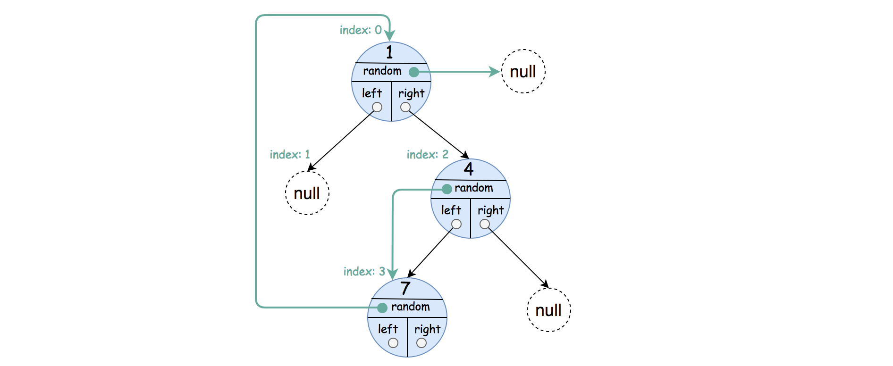
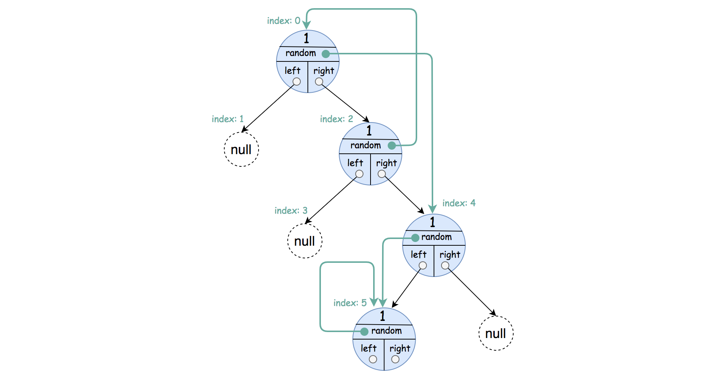
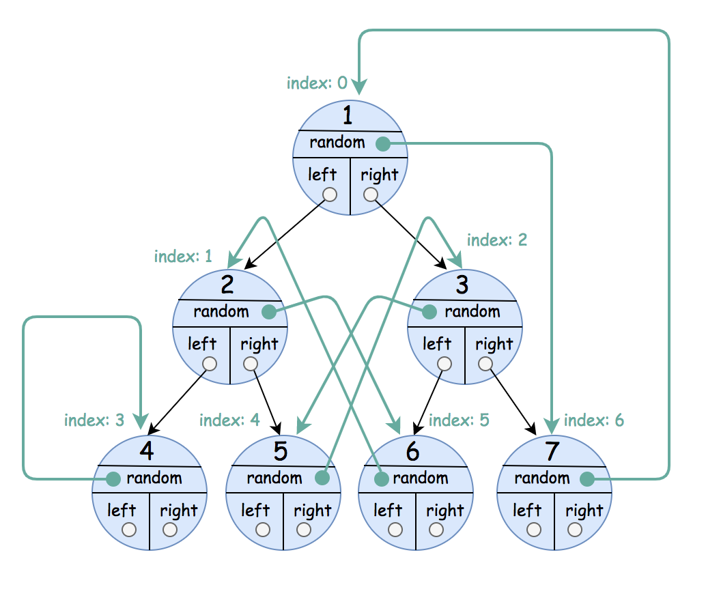

# [1485. 克隆含随机指针的二叉树](https://leetcode-cn.com/problems/clone-binary-tree-with-random-pointer)

[English Version](/solution/1400-1499/1485.Clone%20Binary%20Tree%20With%20Random%20Pointer/README_EN.md)

## 题目描述

<!-- 这里写题目描述 -->

<p>给你一个二叉树，树中每个节点都含有一个附加的随机指针，该指针可以指向树中的任何节点或者指向空（<code>null</code>）。</p>

<p>请返回该树的 <strong><a href="https://baike.baidu.com/item/%E6%B7%B1%E6%8B%B7%E8%B4%9D/22785317?fr=aladdin" target="_blank">深拷贝</a></strong> 。</p>

<p>该树的输入/输出形式与普通二叉树相同，每个节点都用 <code>[val, random_index]</code> 表示：</p>

<ul>
	<li><code>val</code>：表示 <code>Node.val</code> 的整数</li>
	<li><code>random_index</code>：随机指针指向的节点（在输入的树数组中）的下标；如果未指向任何节点，则为 <code>null</code> 。</li>
</ul>

<p>该树以 <code>Node</code> 类的形式给出，而你需要以 <code>NodeCopy</code> 类的形式返回克隆得到的树。<code>NodeCopy</code> 类和<code>Node</code> 类定义一致。</p>

<p>&nbsp;</p>

<p><strong>示例 1：</strong></p>



<pre><strong>输入：</strong>root = [[1,null],null,[4,3],[7,0]]
<strong>输出：</strong>[[1,null],null,[4,3],[7,0]]
<strong>解释：</strong>初始二叉树为 [1,null,4,7] 。
节点 1 的随机指针指向 null，所以表示为 [1, null] 。
节点 4 的随机指针指向 7，所以表示为 [4, 3] 其中 3 是树数组中节点 7 对应的下标。
节点 7 的随机指针指向 1，所以表示为 [7, 0] 其中 0 是树数组中节点 1 对应的下标。
</pre>

<p><strong>示例 2：</strong></p>



<pre><strong>输入：</strong>root = [[1,4],null,[1,0],null,[1,5],[1,5]]
<strong>输出：</strong>[[1,4],null,[1,0],null,[1,5],[1,5]]
<strong>解释：</strong>节点的随机指针可以指向它自身。
</pre>

<p><strong>示例 3：</strong></p>



<pre><strong>输入：</strong>root = [[1,6],[2,5],[3,4],[4,3],[5,2],[6,1],[7,0]]
<strong>输出：</strong>[[1,6],[2,5],[3,4],[4,3],[5,2],[6,1],[7,0]]
</pre>

<p><strong>示例 4：</strong></p>

<pre><strong>输入：</strong>root = []
<strong>输出：</strong>[]
</pre>

<p><strong>示例 5：</strong></p>

<pre><strong>输入：</strong>root = [[1,null],null,[2,null],null,[1,null]]
<strong>输出：</strong>[[1,null],null,[2,null],null,[1,null]]
</pre>

<p>&nbsp;</p>

<p><strong>提示：</strong></p>

<ul>
	<li><code>tree</code> 中节点数目范围是 <code>[0, 1000]</code></li>
	<li>每个节点的值的范围是 <code>[1, 10^6]</code></li>
</ul>


## 解法

<!-- 这里可写通用的实现逻辑 -->

<!-- tabs:start -->

### **Python3**

<!-- 这里可写当前语言的特殊实现逻辑 -->

```python

```

### **Java**

<!-- 这里可写当前语言的特殊实现逻辑 -->

```java

```

### **...**

```

```

<!-- tabs:end -->
