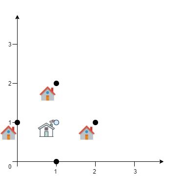
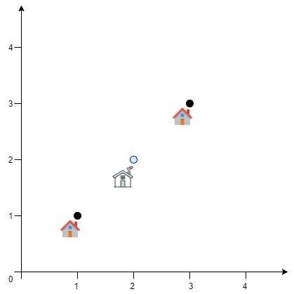

# [1515. 服务中心的最佳位置](https://leetcode-cn.com/problems/best-position-for-a-service-centre)

[English Version](/solution/1500-1599/1515.Best%20Position%20for%20a%20Service%20Centre/README_EN.md)

## 题目描述

<!-- 这里写题目描述 -->
<p>一家快递公司希望在新城市建立新的服务中心。公司统计了该城市所有客户在二维地图上的坐标，并希望能够以此为依据为新的服务中心选址：使服务中心 <strong>到所有客户的欧几里得距离的总和最小</strong> 。</p>

<p>给你一个数组 <code>positions</code> ，其中 <code>positions[i] = [x<sub>i</sub>, y<sub>i</sub>]</code> 表示第 <code>i</code> 个客户在二维地图上的位置，返回到所有客户的 <strong>欧几里得距离的最小总和 。</strong></p>

<p>换句话说，请你为服务中心选址，该位置的坐标 <code>[x<sub>centre</sub>, y<sub>centre</sub>]</code> 需要使下面的公式取到最小值：</p>


<p>与真实值误差在 <code>10^-5</code> 之内的答案将被视作正确答案。</p>

<p>&nbsp;</p>

<p><strong>示例 1：</strong></p>



<pre><strong>输入：</strong>positions = [[0,1],[1,0],[1,2],[2,1]]
<strong>输出：</strong>4.00000
<strong>解释：</strong>如图所示，你可以选 [x<sub>centre</sub>, y<sub>centre</sub>] = [1, 1] 作为新中心的位置，这样一来到每个客户的距离就都是 1，所有距离之和为 4 ，这也是可以找到的最小值。
</pre>

<p><strong>示例 2：</strong></p>



<pre><strong>输入：</strong>positions = [[1,1],[3,3]]
<strong>输出：</strong>2.82843
<strong>解释：</strong>欧几里得距离可能的最小总和为 sqrt(2) + sqrt(2) = 2.82843
</pre>

<p><strong>示例 3：</strong></p>

<pre><strong>输入：</strong>positions = [[1,1]]
<strong>输出：</strong>0.00000
</pre>

<p><strong>示例 4：</strong></p>

<pre><strong>输入：</strong>positions = [[1,1],[0,0],[2,0]]
<strong>输出：</strong>2.73205
<strong>解释：</strong>乍一看，你可能会将中心定在 [1, 0] 并期待能够得到最小总和，但是如果选址在 [1, 0] 距离总和为 3
如果将位置选在 [1.0, 0.5773502711] ，距离总和将会变为 2.73205
当心精度问题！
</pre>

<p><strong>示例 5：</strong></p>

<pre><strong>输入：</strong>positions = [[0,1],[3,2],[4,5],[7,6],[8,9],[11,1],[2,12]]
<strong>输出：</strong>32.94036
<strong>解释：</strong>你可以用 [4.3460852395, 4.9813795505] 作为新中心的位置
</pre>

<p>&nbsp;</p>

<p><strong>提示：</strong></p>

<ul>
	<li><code>1 &lt;=&nbsp;positions.length &lt;= 50</code></li>
	<li><code>positions[i].length == 2</code></li>
	<li><code>0 &lt;=&nbsp;positions[i][0],&nbsp;positions[i][1] &lt;= 100</code></li>
</ul>


## 解法

<!-- 这里可写通用的实现逻辑 -->


<!-- tabs:start -->

### **Python3**

<!-- 这里可写当前语言的特殊实现逻辑 -->

```python

```

### **Java**

<!-- 这里可写当前语言的特殊实现逻辑 -->

```java

```

### **...**
```

```

<!-- tabs:end -->