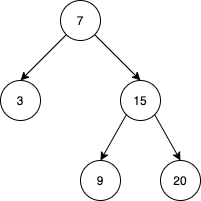

# [1586. Binary Search Tree Iterator II](https://leetcode.com/problems/binary-search-tree-iterator-ii)

[中文文档](/solution/1500-1599/1586.Binary%20Search%20Tree%20Iterator%20II/README.md)

## Description

<p>Implement the <code>BSTIterator</code> class that represents an iterator over the <strong><a href="https://en.wikipedia.org/wiki/Tree_traversal#In-order_(LNR)">in-order traversal</a></strong> of a binary search tree (BST):</p>

<ul>
	<li><code>BSTIterator(TreeNode root)</code> Initializes an object of the <code>BSTIterator</code> class. The <code>root</code> of the BST is given as part of the constructor. The pointer should be initialized to a non-existent number smaller than any element in the BST.</li>
	<li><code>boolean hasNext()</code> Returns <code>true</code> if there exists a number in the traversal to the right of the pointer, otherwise returns <code>false</code>.</li>
	<li><code>int next()</code> Moves the pointer to the right, then returns the number at the pointer.</li>
	<li><code>boolean hasPrev()</code> Returns <code>true</code> if there exists a number in the traversal to the left of the pointer, otherwise returns <code>false</code>.</li>
	<li><code>int prev()</code> Moves the pointer to the left, then returns the number at the pointer.</li>
</ul>

<p>Notice that by initializing the pointer to a non-existent smallest number, the first call to <code>next()</code> will return the smallest element in the BST.</p>

<p>You may assume that <code>next()</code> and <code>prev()</code> calls will always be valid. That is, there will be at least a next/previous number in the in-order traversal when <code>next()</code>/<code>prev()</code> is called.</p>

<p>&nbsp;</p>
<p><strong>Example 1:</strong></p>



<pre>
<strong>Input</strong>
[&quot;BSTIterator&quot;, &quot;next&quot;, &quot;next&quot;, &quot;prev&quot;, &quot;next&quot;, &quot;hasNext&quot;, &quot;next&quot;, &quot;next&quot;, &quot;next&quot;, &quot;hasNext&quot;, &quot;hasPrev&quot;, &quot;prev&quot;, &quot;prev&quot;]
[[[7, 3, 15, null, null, 9, 20]], [null], [null], [null], [null], [null], [null], [null], [null], [null], [null], [null], [null]]
<strong>Output</strong>
[null, 3, 7, 3, 7, true, 9, 15, 20, false, true, 15, 9]

<strong>Explanation</strong>
// The underlined element is where the pointer currently is.
BSTIterator bSTIterator = new BSTIterator([7, 3, 15, null, null, 9, 20]); // state is <u> </u> [3, 7, 9, 15, 20]
bSTIterator.next(); // state becomes [<u>3</u>, 7, 9, 15, 20], return 3
bSTIterator.next(); // state becomes [3, <u>7</u>, 9, 15, 20], return 7
bSTIterator.prev(); // state becomes [<u>3</u>, 7, 9, 15, 20], return 3
bSTIterator.next(); // state becomes [3, <u>7</u>, 9, 15, 20], return 7
bSTIterator.hasNext(); // return true
bSTIterator.next(); // state becomes [3, 7, <u>9</u>, 15, 20], return 9
bSTIterator.next(); // state becomes [3, 7, 9, <u>15</u>, 20], return 15
bSTIterator.next(); // state becomes [3, 7, 9, 15, <u>20</u>], return 20
bSTIterator.hasNext(); // return false
bSTIterator.hasPrev(); // return true
bSTIterator.prev(); // state becomes [3, 7, 9, <u>15</u>, 20], return 15
bSTIterator.prev(); // state becomes [3, 7, <u>9</u>, 15, 20], return 9
</pre>

<p>&nbsp;</p>
<p><strong>Constraints:</strong></p>

<ul>
	<li>The number of nodes in the tree is in the range <code>[1, 10<sup>5</sup>]</code>.</li>
	<li><code>0 &lt;= Node.val &lt;= 10<sup>6</sup></code></li>
	<li>At most <code>10<sup>5</sup></code> calls will be made to <code>hasNext</code>, <code>next</code>, <code>hasPrev</code>, and <code>prev</code>.</li>
</ul>

<p>&nbsp;</p>
<strong>Follow up:</strong> Could you solve the problem without precalculating the values of the tree?

## Solutions

<!-- tabs:start -->

### **Python3**

```python

```

### **Java**

```java

```

### **...**

```

```

<!-- tabs:end -->
