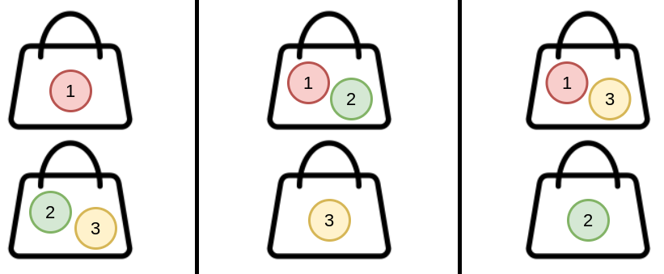

# [1692. 计算分配糖果的不同方式](https://leetcode-cn.com/problems/count-ways-to-distribute-candies)

[English Version](/solution/1600-1699/1692.Count%20Ways%20to%20Distribute%20Candies/README_EN.md)

## 题目描述

<!-- 这里写题目描述 -->

<p>现有 <code>n</code> 颗 <strong>不同</strong> 糖果（分别标记为 <code>1</code> 到 <code>n</code> ）和 <code>k</code> 个相同的手袋。请把糖果分配到各个手袋中并保证每个手袋里至少有一颗糖果。</p>

<p>不考虑手袋和糖果的摆放顺序，会有多种不同的分配方式。如果某种分配方式中其中一个手袋里的糖果与另一种分配方式中所有手袋里的糖果都不相同，则认为这两种分配方式不同。</p>

<p>例如，<code>(1), (2,3)</code> 与<code>(2), (1,3)</code>的分配方式是不同的，因为第一种分配方式中手袋(2,3)里的糖果2和3，在第二种分配方式中被分配到了手袋<code>(2)</code>和<code>(1,3)</code> 中。</p>

<p>已知整数 <code>n</code> 和 <code>k</code>, 请返回分配糖果的不同方式。返回的答案如果数值太大，请取<code>10<sup>9</sup> + 7</code>的模，并返回。</p>

<p> </p>

<p><strong>示例 1：</strong></p>



<pre>
<strong>输入：</strong>n = 3, k = 2
<strong>输出：</strong>3
<strong>解释：</strong>把糖果 3 分配到 2 个手袋中的一个，共有 3 种方式:
(1), (2,3)
(1,2), (3)
(1,3), (2)
</pre>

<p><strong>示例 2：</strong></p>

<pre>
<strong>输入：</strong>n = 4, k = 2
<strong>输出：</strong>6
<strong>解释：</strong>把糖果 4 分配到 2 个手袋中的一个，共有 7 种方式:
(1), (2,3,4)s
(1,2), (3,4)
(1,3), (2,4)
(1,4), (2,3)
(1,2,3), (4)
(1,2,4), (3)
(1,3,4), (2)
</pre>

<p><strong>示例 3：</strong></p>

<pre>
<strong>输入：</strong>n = 20, k = 5
<strong>输出：</strong>206085257
<strong>解释：</strong>把 20 颗糖果分配到 5 个手袋种，共有 1881780996 种方式。1881780996 取 10<sup>9</sup> + 7的模，等于 206085257。
</pre>

<p> </p>

<p><strong>提示：</strong></p>

<ul>
	<li><code>1 <= k <= n <= 1000</code></li>
</ul>


## 解法

<!-- 这里可写通用的实现逻辑 -->

<!-- tabs:start -->

### **Python3**

<!-- 这里可写当前语言的特殊实现逻辑 -->

```python

```

### **Java**

<!-- 这里可写当前语言的特殊实现逻辑 -->

```java

```

### **...**

```

```

<!-- tabs:end -->
