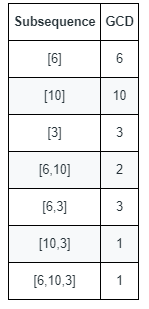

# [1819. Number of Different Subsequences GCDs](https://leetcode.com/problems/number-of-different-subsequences-gcds)

[中文文档](/solution/1800-1899/1819.Number%20of%20Different%20Subsequences%20GCDs/README.md)

## Description

<p>You are given an array <code>nums</code> that consists of positive integers.</p>

<p>The <strong>GCD</strong> of a sequence of numbers is defined as the greatest integer that divides <strong>all</strong> the numbers in the sequence evenly.</p>

<ul>
	<li>For example, the GCD of the sequence <code>[4,6,16]</code> is <code>2</code>.</li>
</ul>

<p>A <strong>subsequence</strong> of an array is a sequence that can be formed by removing some elements (possibly none) of the array.</p>

<ul>
	<li>For example, <code>[2,5,10]</code> is a subsequence of <code>[1,2,1,<strong><u>2</u></strong>,4,1,<u><strong>5</strong></u>,<u><strong>10</strong></u>]</code>.</li>
</ul>

<p>Return <em>the <strong>number</strong> of <strong>different</strong> GCDs among all <strong>non-empty</strong> subsequences of</em> <code>nums</code>.</p>

<p>&nbsp;</p>
<p><strong>Example 1:</strong></p>



<pre>
<strong>Input:</strong> nums = [6,10,3]
<strong>Output:</strong> 5
<strong>Explanation:</strong> The figure shows all the non-empty subsequences and their GCDs.
The different GCDs are 6, 10, 3, 2, and 1.
</pre>

<p><strong>Example 2:</strong></p>

<pre>
<strong>Input:</strong> nums = [5,15,40,5,6]
<strong>Output:</strong> 7
</pre>

<p>&nbsp;</p>
<p><strong>Constraints:</strong></p>

<ul>
	<li><code>1 &lt;= nums.length &lt;= 10<sup>5</sup></code></li>
	<li><code>1 &lt;= nums[i] &lt;= 2 * 10<sup>5</sup></code></li>
</ul>


## Solutions

<!-- tabs:start -->

### **Python3**

```python

```

### **Java**

```java

```

### **...**

```

```

<!-- tabs:end -->
